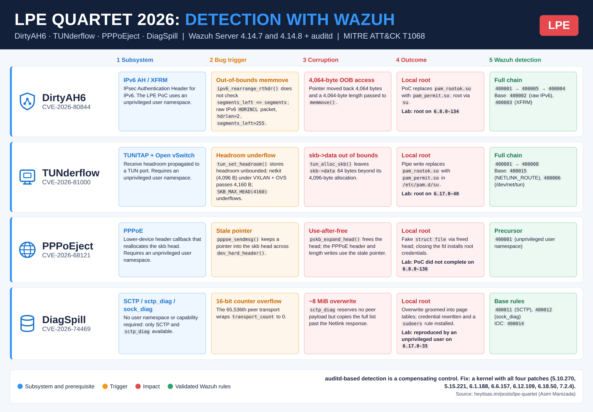

# LPE Quartet Detection with Wazuh 4.14.8

> **Detection engineering for four Linux kernel local privilege escalation flaws:**

· DirtyAH6 / TUNderflow / PPPoEject / DiagSpill - Ubuntu 24.04.5 LTS ·


---



---

## What is the LPE Quartet?

On 2026-09-18, Asim Manizada disclosed four independent local privilege escalation (LPE) vulnerabilities in the Linux kernel networking stack, each with a public proof-of-concept (PoC) exploit:

| Name | CVE | Subsystem | Root cause |
|---|---|---|---|
| DirtyAH6 | CVE-2026-80844 | IPv6 Authentication Header (AH6/XFRM) | `ipv6_rearrange_rthdr()` trusts the routing header segment count without validating `segments_left`, moving a pointer out of bounds before `memmove()` |
| TUNderflow | CVE-2026-81000 | TUN/TAP | `tun_set_headroom()` stores headroom without bounds checks; a `netkit` device with 4,096 bytes of headroom under VXLAN and an Open vSwitch datapath underflows `SKB_MAX_HEAD` |
| PPPoEject | CVE-2026-68121 | PPPoE | `pppoe_sendmsg()` keeps a pointer to the `skb` head across `dev_hard_header()`, which can call `pskb_expand_head()` and free it (use-after-free) |
| DiagSpill | CVE-2026-74469 | SCTP / `sock_diag` | The 16-bit SCTP `transport_count` overflows to zero at transport 65,536; `sctp_diag` reserves space for zero peers but copies the full list, writing about 8 MiB past the Netlink reply |

Three of the four require only an **unprivileged user namespace**. DiagSpill requires **no namespace and no special capability**, only the SCTP module and `sctp_diag` available.

> Discovered and published by **Asim Manizada**.

---

## Official References

| Resource | Link |
|---|---|
| Original research - A quartet of Linux local root vulns | https://heyitsas.im/posts/lpe-quartet/ |
| The Hacker News coverage | https://thehackernews.com/2026/09/public-exploits-released-for-four-linux.html |
| Red Hat - CVE-2026-74469 | https://access.redhat.com/security/cve/cve-2026-74469 |
| PoC - DirtyAH6 | https://github.com/manizada/DirtyAH6 |
| PoC - TUNderflow | https://github.com/manizada/TUNderflow |
| PoC - PPPoEject | https://github.com/manizada/PPPoEject |
| PoC - DiagSpill | https://github.com/manizada/DiagSpill |
| Wazuh - Audit configuration | https://documentation.wazuh.com/current/user-manual/capabilities/system-calls-monitoring/audit-configuration.html |
| Wazuh - Rules syntax | https://documentation.wazuh.com/current/user-manual/ruleset/ruleset-xml-syntax/rules.html |
| Wazuh - Creating custom SCA policies | https://documentation.wazuh.com/4.14/user-manual/capabilities/sec-config-assessment/creating-custom-policies.html |
| Wazuh - How to configure SCA | https://documentation.wazuh.com/4.14/user-manual/capabilities/sec-config-assessment/how-to-configure.html |
| Wazuh - auditd decoders (v4.14.8) | https://github.com/wazuh/wazuh/blob/v4.14.8/ruleset/decoders/0040-auditd_decoders.xml |
| MITRE ATT&CK T1068 | https://attack.mitre.org/techniques/T1068/ |

---

## Why This Repo Exists

All four flaws corrupt kernel memory. Nothing is written to disk that file integrity monitoring could compare against a baseline, and the exploitation primitives are ordinary syscalls available to unprivileged users: namespace creation, socket creation with a specific family/protocol, and Netlink queries.

**Detection has to be behavioral**, at the syscall level. This repository provides auditd sensor rules and Wazuh detection rules built on four axes, plus an SCA policy that checks the sensor and the exploit prerequisites on each endpoint:

```
Axis 1 - Common precursor     unprivileged user namespace (unshare / setns)
Axis 2 - Required condition   socket family / protocol / device each exploit needs
Axis 3 - Correlation          precursor + condition in the same login session (audit.session)
Axis 4 - Low-confidence IOC   execution of binaries named after the public PoCs from /tmp or /dev/shm
```

---

## Exploit Prerequisites Observed by the Sensor

```
DirtyAH6    unshare/setns -> socket(AF_NETLINK, NETLINK_XFRM) -> socket(AF_INET6, SOCK_RAW)
TUNderflow  unshare/setns -> /dev/net/tun + socket(AF_NETLINK, NETLINK_ROUTE) (netkit / VXLAN setup)
PPPoEject   unshare/setns (precursor only)
DiagSpill   socket(SCTP)  -> socket(AF_NETLINK, NETLINK_SOCK_DIAG) query
```

---

## Affected Kernels and Fixed Versions

The fix is available in the following stable kernels and later:

| Branch | Fixed in |
|---|---|
| 5.10 | 5.10.270 |
| 5.15 | 5.15.221 |
| 6.1 | 6.1.188 |
| 6.6 | 6.6.157 |
| 6.12 | 6.12.109 |
| 6.18 | 6.18.50 |
| 7.2 | 7.2.4 |

### Lab Kernels Used for Validation

Each PoC fingerprints an exact kernel build. Kernels were selected per test with `grub-reboot`.

| CVE | Target kernel (Ubuntu 24.04.5 LTS) | Result |
|---|---|---|
| DirtyAH6 | 6.8.0-134-generic | ROOT CONFIRMED |
| TUNderflow | 6.17.0-40-generic | ROOT CONFIRMED |
| PPPoEject | 6.8.0-136-generic | NOT REPRODUCED |
| DiagSpill | 6.17.0-35-generic | REPRODUCED |

---

## Repository Structure

```
LPE-Quartet-Detection-with-Wazuh-4.14.8/
|
+-- rules/
|   +-- lpe_quartet.xml              # 17 Wazuh detection rules
|
+-- audit_sensor/
|   +-- lpe-quartet-2026.rules       # 17 auditd syscall and watch sensor rules
|
+-- SCA/
|   +-- lpe_quartet_2026.yml         # Wazuh SCA policy (7 checks)
|
+-- LICENSE                          # MIT
+-- README.md
```

---

## Detection Architecture

### Layer 1 - auditd Sensor Keys

All syscall rules filter on `uid!=0`, covering interactive users, service accounts and processes without a login session.

| auditd key | Type | Observes |
|---|---|---|
| `lpe_quartet_userns` | syscall | `unshare` / `setns` (common precursor) |
| `lpe_quartet_rawv6` | syscall | `socket` AF_INET6 raw, `SOCK_RAW` and `SOCK_RAW\|SOCK_CLOEXEC` (DirtyAH6) |
| `lpe_quartet_xfrm` | syscall | `socket` AF_NETLINK / NETLINK_XFRM (DirtyAH6) |
| `lpe_quartet_tun` | watch | `/dev/net/tun` access (TUNderflow) |
| `lpe_quartet_netlink_route` | syscall | `socket` AF_NETLINK / NETLINK_ROUTE (TUNderflow) |
| `lpe_quartet_sctp` | syscall | `socket` with SCTP protocol (DiagSpill) |
| `lpe_quartet_sockdiag` | syscall | `socket` AF_NETLINK / NETLINK_SOCK_DIAG (DiagSpill) |
| `lpe_quartet_tmp_exec` | watch | execution from `/tmp` and `/dev/shm` (IOC) |

### Layer 2 - Wazuh Rule Chain

```
80700 / 80730 (auditd)
 |- 400001  lpe_quartet_userns          common precursor
 |- 400002  lpe_quartet_rawv6          ---> 400004 (+400001)
 |- 400003  lpe_quartet_xfrm           ---> 400005 (+400001)
 |- 400006  lpe_quartet_tun           -+
 |- 400007  lpe_quartet_netlink_route -+--> 400008 (+400001)
 |- 400009  lpe_quartet_sctp
 |- 400010  lpe_quartet_sockdiag
 |- 400011  lpe_quartet_tmp_exec + public PoC binary name
```

`(+400001)` means correlation with the precursor in the same `audit.session`.

#### Detection rules (uid != 0)

| Rule | Level | CVE | Type | Signal | Status |
|---|---|---|---|---|---|
| **400001** | 5 | All (except DiagSpill) | Base | Unprivileged user namespace (`lpe_quartet_userns`) | CONFIRMED (4.14.8) |
| **400002** | 8 | DirtyAH6 | Base | Raw IPv6 socket (`lpe_quartet_rawv6`) | CONFIRMED (via 400004, 4.14.8) |
| **400003** | 8 | DirtyAH6 | Base | NETLINK_XFRM socket (`lpe_quartet_xfrm`) | CONFIRMED (via 400005, 4.14.8) |
| **400004** | 14 | DirtyAH6 | Correlation | userns + raw IPv6 socket, same session | CONFIRMED (4.14.8) |
| **400005** | 12 | DirtyAH6 | Correlation | userns + NETLINK_XFRM socket, same session | CONFIRMED (4.14.8) |
| **400006** | 5 | TUNderflow | Base | `/dev/net/tun` access (`lpe_quartet_tun`) | CONFIRMED (manual `open()`) |
| **400007** | 6 | TUNderflow | Base | NETLINK_ROUTE socket (`lpe_quartet_netlink_route`) | CONFIRMED (4.14.8) |
| **400008** | 14 | TUNderflow | Correlation | userns + (`/dev/net/tun` or NETLINK_ROUTE), same session | CONFIRMED (4.14.8) |
| **400009** | 8 | DiagSpill | Base | SCTP socket (`lpe_quartet_sctp`) | CONFIRMED (4.14.8) |
| **400010** | 6 | DiagSpill | Base | NETLINK_SOCK_DIAG query (`lpe_quartet_sockdiag`) | CONFIRMED (4.14.8) |
| **400011** | 6 | All | IOC | PoC-named binary executed from `/tmp` or `/dev/shm` | CONFIRMED (4.14.8) |

#### Root-context indicators (uid = 0, level 3 - measurement phase)

These rules fire on the same syscalls observed from a root-context process. They are low-level indicators intended to surface unexpected privileged activity for triage. PoC validation targets unprivileged users by design; these rules were not exercised with PoC runs.

| Rule | CVE | Signal |
|---|---|---|
| **400012** | All (except DiagSpill) | Root process: user namespace created |
| **400013** | DirtyAH6 | Root process: raw IPv6 socket created |
| **400014** | DirtyAH6 | Root process: NETLINK_XFRM socket created |
| **400015** | TUNderflow | Root process: NETLINK_ROUTE socket created |
| **400016** | DiagSpill | Root process: SCTP socket created |
| **400017** | DiagSpill | Root process: NETLINK_SOCK_DIAG socket created |

Status criterion: **CONFIRMED** only when the rule fired in Wazuh Discover from a real PoC execution (or, where stated, a manual trigger of the same syscall). `wazuh-logtest` results are not counted as validation. Rules without real evidence (PPPoEject-specific socket and correlation, DiagSpill correlation, CLI netkit setup) are not shipped.

> **Engineering note**: All correlation rules bind on `same_field` `audit.session`, not `audit.pid`. The DirtyAH6 PoC spreads its steps across different processes (e.g. `esp_receiver` and `ah6_sender`, distinct PIDs) inside the same login session, so a PID-bound correlation never matches the real exploit chain.

> **Engineering note**: On Ubuntu 24.04, AppArmor logs a `type=AVC` (`userns_create`) record before the `type=SYSCALL` record when an unprivileged user creates a user namespace. The Wazuh `auditd-syscall` decoder only runs when the event starts with `SYSCALL` or `EXECVE`, so `audit.key` is not extracted and the event lands on rule `80730`. Rule `400001` hangs from both `80700` and `80730` and matches the key on the full log to cover both layouts.

### Layer 3 - SCA Policy

| ID | Check | Relation to the LPE Quartet |
|---|---|---|
| 400101 | auditd is running | Detection sensor |
| 400102 | `lpe-quartet-2026.rules` present with the 8 keys | Detection sensor |
| 400103 | The 8 keys loaded in the kernel (`auditctl -l`) | Detection sensor |
| 400104 | Unprivileged user namespaces disabled (`user.max_user_namespaces = 0` or `kernel.unprivileged_userns_clone = 0`) | Prerequisite of DirtyAH6, TUNderflow, PPPoEject |
| 400105 | `sctp` module disabled and not loaded | Prerequisite of DiagSpill |
| 400106 | `pppoe` module disabled and not loaded | Prerequisite of PPPoEject |
| 400107 | `ah6` module disabled and not loaded | Prerequisite of DirtyAH6 |

`400104` does not accept `kernel.apparmor_restrict_unprivileged_userns = 1` alone as a mitigation: in the lab, `unshare -U` by an unprivileged user returned `rc=0` with that restriction active. Kernel version is not checked, because the fixed versions are published for the upstream kernel and do not map directly to distribution package numbering.

---

## Deployment

### Step 1 - Install auditd

```bash
# Ubuntu / Debian
apt install auditd audispd-plugins -y
systemctl enable --now auditd
auditctl -s | grep enabled
```

```bash
# RHEL / Amazon Linux
yum install audit -y
systemctl enable --now auditd
```

### Step 2 - Deploy auditd sensor rules (endpoint)

```bash
cp audit_sensor/lpe-quartet-2026.rules /etc/audit/rules.d/
chown root:root /etc/audit/rules.d/lpe-quartet-2026.rules
chmod 640 /etc/audit/rules.d/lpe-quartet-2026.rules
augenrules --load
auditctl -l | grep -c lpe_quartet    # expected: 17
```

Every key listed in [Layer 1](#layer-1---auditd-sensor-keys) must appear in `auditctl -l`.

> **Rule overlap**: if another project on the same host already loads auditd rules with the same syscall and the same filter fields (`arch=b64` + `uid!=0`), review both files before loading. In the lab, `lpe_quartet_userns` produced no events while an older rule set with matching filters was loaded, and started firing once that rule set was removed. Where another rule set already covers the syscall, reuse its key instead of duplicating it.

### Step 3 - Deploy Wazuh detection rules (Wazuh Server)

```bash
cp rules/lpe_quartet.xml /var/ossec/etc/rules/lpe_quartet.xml
chown wazuh:wazuh /var/ossec/etc/rules/lpe_quartet.xml
chmod 660 /var/ossec/etc/rules/lpe_quartet.xml
```

```bash
# Validate syntax - must exit 0 with zero warnings
/var/ossec/bin/wazuh-analysisd -t 2>&1 | tail -5

# Restart manager
systemctl restart wazuh-manager
```

### Step 4 - Configure ossec.conf localfile (endpoint)

Ensure the agent ingests the auditd log:

```xml
<!-- Add inside <ossec_config> -->
<localfile>
  <log_format>audit</log_format>
  <location>/var/log/audit/audit.log</location>
</localfile>
```

```bash
systemctl restart wazuh-agent
```

### Step 5 - Deploy the SCA policy (endpoint)

```bash
cp SCA/lpe_quartet_2026.yml /var/ossec/ruleset/sca/
chown root:wazuh /var/ossec/ruleset/sca/lpe_quartet_2026.yml
chmod 640 /var/ossec/ruleset/sca/lpe_quartet_2026.yml
systemctl restart wazuh-agent
grep -i lpe_quartet /var/ossec/logs/ossec.log
```

Expected log sequence: `Loaded policy`, `Starting evaluation of policy` and `Evaluation finished for policy`. The policy is a local file on the agent, so `sca.remote_commands` is not required; that option is only needed when the Wazuh Server pushes policies with command rules.

---

## Validation

### Quick test (no exploit)

```bash
# Rule 400001 - unprivileged user namespace (run as a non-root user)
unshare -U true; echo rc=$?

# Rule 400006 - /dev/net/tun watch
cat /dev/net/tun
```

Confirm the alerts in Wazuh Discover with `rule.id: 400001` or `rule.id: 400006` and the agent name.

### Verify all sensor keys after a PoC run

```bash
for k in userns rawv6 xfrm tun netlink_route sctp sockdiag tmp_exec; do
  printf '%-26s %s\n' "lpe_quartet_$k" "$(ausearch -k lpe_quartet_$k -ts today 2>/dev/null | grep -c '^----')"
done
```

> On Ubuntu 24.04, `ausearch` did not return the `unshare` events that carry the AppArmor `type=AVC` record, although they were present in `/var/log/audit/audit.log` and in Wazuh Discover. Use Discover or `grep lpe_quartet_userns /var/log/audit/audit.log` to confirm the precursor.

---

## Production Validation Evidence

Lab: Wazuh Server 4.14.8, agent on Ubuntu 24.04.5 LTS. All PoCs executed from an unprivileged user (`uid=1004`, no `sudo`, `lxd` or `adm` group membership).

### DirtyAH6 - CVE-2026-80844 (kernel 6.8.0-134-generic)

Full chain confirmed in the same login session (`ses=2`), root obtained (Sep 26, 2026 @ 21:17:00 UTC-3). The `unshare -Urn` call was denied by AppArmor; the PoC fell back to `aa-exec -p trinity` and then `nsenter`:

| Time (UTC-3) | Rule | Key | Process |
|---|---|---|---|
| 21:16:49.886 | 400001 | `lpe_quartet_userns` | `/usr/bin/nsenter` |
| 21:16:49.904 | 400005 | `lpe_quartet_xfrm` | `esp_receiver` (pid 4376) / `/usr/bin/ip` |
| 21:16:50.665 | 400004 | `lpe_quartet_rawv6` | `ah6_sender` (pid 4413) |


---

### TUNderflow - CVE-2026-81000 (kernel 6.17.0-40-generic)

Root obtained (Sep 26, 2026 @ 20:40:45 UTC-3). `unshare -Urn` was denied by AppArmor; the PoC fell back to `aa-exec -p trinity`. Correlation `400001` -> `400008` confirmed in the same login session (`ses=1`). `400007` (NETLINK_ROUTE base) fired 7 times; `400008` (correlation, level 14) fired 116 times from `/usr/bin/ip` called repeatedly during network device setup:


Rule `400006` validated separately with a manual `open()` on `/dev/net/tun` (`exe=/usr/bin/cat`). The TUNderflow PoC manipulates the device without an observable `open()` on the path, so `400006` is a generic prerequisite indicator rather than a trigger of the script flow:


---

### DiagSpill - CVE-2026-74469 (kernel 6.17.0-35-generic)

Executed from a dedicated unprivileged user with no `sudo`, `lxd` or `adm` membership. DiagSpill is the only variant that requires no user namespace. Rules `400009` (SCTP socket), `400010` (sock_diag query, 85+ events across processes `diag_wall`, `network_setup` and `diag_fill`) and `400011` (PoC-named binary in `/tmp`) fired. The VM became unresponsive during the `diag_fill` phase, consistent with the ~8 MiB out-of-bounds write completing the Netlink dump:


> **Decoder note**: The PoC binary removes itself from disk at startup (`unlink(argv[0])`). Once removed, the kernel reports the executable path with a ` (deleted)` suffix and auditd records the `exe` field in hexadecimal without quotes. The auditd decoder in Wazuh 4.14.8 (`0040-auditd_decoders.xml`, line 27) requires `exe` in quoted form; events with a hex-encoded `exe` are decoded partially - `audit.command` and `audit.key` are extracted but `uid`, `auid`, `exe`, `pid`, `ppid` and `session` are not indexed as structured fields. The detection rules fire correctly via `audit.key`; the missing fields are available in `full_log`.

---

### PPPoEject - CVE-2026-68121 (kernel 6.8.0-136-generic)

Tested with default Ubuntu 24.04.5 kernel security settings (no boot parameter changes). Two barriers prevented the PoC from reaching the AF_PPPOX socket:

1. **KPTI active**: the PoC's kernel-text layout helper exited with status 2 (`kernel text is not mapped in the user page table`) before creating the socket.
2. **AppArmor `unprivileged_userns` profile**: even with KPTI disabled, AppArmor denies `CAP_SYS_ADMIN` (capability 21) to the `unshare` process, as confirmed by a `type=AVC apparmor="DENIED"` record in the lab (`auid=1000`, `uid=1004`, `ses=2`).

Only the shared precursor `400001` was observed (`exe=/usr/bin/unshare`, `key=lpe_quartet_userns`). PPPoEject is covered by the precursor and by SCA check `400106`. No kernel mitigation was disabled to force progression.

---

### SCA - LPE Quartet 2026 policy

Result on the lab endpoint: 3 passed (`400101`-`400103`), 4 failed (`400104`-`400107`), 0 not applicable, score 42%. The endpoint has the full detection in place and remains exposed to the four prerequisites, which is the scenario where the detection acts as a compensating control.


---

## Known Limitations

1. **DirtyAH6 fallback path.** The PoC has two code paths. The active exploitation path creates the raw IPv6 socket and fires the full chain. When the PoC reports the target as already patched, it still escalates to root through a fallback path that generated no events on any `lpe_quartet_*` key (same kernel, `lost=0`). `lpe_quartet_rawv6` covers active exploitation only.
2. **Base rules are noisy by themselves.** `400007` (NETLINK_ROUTE) fires from `/usr/bin/ip`, `apt`, `sudo`, `fwupdmgr` and `systemd-tmpfiles`; `lpe_quartet_xfrm` fires from `ip xfrm`. `400010` also fires from `ss` and routine monitoring tools. Triage on the correlation rules, not on the base rules alone, and apply exceptions to base rules only.
3. **Cross-triggering between CVEs.** `400008` (TUNderflow) also fired during a DirtyAH6 run, because that PoC calls `/usr/bin/ip` inside the user namespace, which creates a NETLINK_ROUTE socket in the same session. Treat `400008` as "user namespace + network configuration", not as TUNderflow-specific evidence.
4. **TUNderflow and `400006`.** The TUNderflow PoC does not produce an observable `open()` on `/dev/net/tun`, so `400006` is a prerequisite indicator, not a trigger of the exploit flow. The detection signal is `400001` -> `400008`.
5. **PPPoEject coverage.** The PoC did not reach the AF_PPPOX socket on the test kernel under default Ubuntu 24.04.5 security settings. PPPoEject is covered by the precursor `400001` and by SCA check `400106`.
6. **DiagSpill correlation.** A SCTP + sock_diag correlation does not match the real PoC event sequence (one SCTP socket, a burst of sock_diag queries, then another SCTP socket), so it is not shipped. DiagSpill is detected by its base rules `400009` and `400010`.
7. **`400011` matches `audit.exe`.** For interpreted PoCs (for example `python3 /tmp/<poc>.py`), `audit.exe` is the interpreter and the rule does not match. The rule fires for compiled binaries executed directly from `/tmp` or `/dev/shm`.
8. **Path watches and reboots.** auditd `-w` watches bind to the inode at load time. For device nodes recreated at boot, such as `/dev/net/tun`, run `augenrules --load` after boot and confirm with `auditctl -l` before validating.

---

## File Integrity (SHA-256)

Run the command below on the deployed files to verify integrity against the values recorded at release:

```bash
sha256sum rules/lpe_quartet.xml audit_sensor/lpe-quartet-2026.rules SCA/lpe_quartet_2026.yml
```

| File | SHA-256 |
|---|---|
| `rules/lpe_quartet.xml` | `89d60dd74887180c8adea5f6697c913fc4374fe96ef26a5dcf48e452a26cd193` |
| `audit_sensor/lpe-quartet-2026.rules` | `caabc7c87293b508084c3a8b667c4923a560c71f0cbbe3072ad4623c49bcb832` |
| `SCA/lpe_quartet_2026.yml` | `244af6ca132231d483df2ca91edbbf827793eeffdf92f02862c83ce27f50126a` |

---

## Remediation

Detection via auditd is a compensating control and does not replace the patch.

### Permanent fix

Upgrade to a fixed kernel (see [Affected Kernels and Fixed Versions](#affected-kernels-and-fixed-versions)) through your distribution's kernel update:

```bash
# Ubuntu / Debian
apt update && apt upgrade linux-generic

# RHEL / Amazon Linux
dnf update kernel
```

### Prerequisite hardening (until the kernel is updated)

The SCA policy checks the following controls. Evaluate the operational impact before applying them:

```bash
# Unprivileged user namespaces (DirtyAH6, TUNderflow, PPPoEject)
# Impact: breaks rootless containers and browser sandboxes that rely on user namespaces
echo 'user.max_user_namespaces = 0' > /etc/sysctl.d/99-lpe-quartet.conf && sysctl --system

# sctp (DiagSpill), pppoe (PPPoEject), ah6 (DirtyAH6) - only on hosts that do not use them
printf 'install sctp /bin/false\nblacklist sctp\n' > /etc/modprobe.d/lpe-quartet-sctp.conf
printf 'install pppoe /bin/false\nblacklist pppoe\n' > /etc/modprobe.d/lpe-quartet-pppoe.conf
printf 'install ah6 /bin/false\nblacklist ah6\n' > /etc/modprobe.d/lpe-quartet-ah6.conf
```

---

## Disclosure Timeline

| Date | Event |
|---|---|
| 2026-09-18 | Public disclosure by Asim Manizada, with PoCs for all four vulnerabilities |

---

## Comparison Across the Quartet

| | DirtyAH6 | TUNderflow | PPPoEject | DiagSpill |
|---|---|---|---|---|
| Bug class | Out-of-bounds write | Integer underflow | Use-after-free | Integer overflow / heap overflow |
| Unprivileged userns required | Yes | Yes | Yes | No |
| Remote impact | DoS only (IPv6 AH transport-mode gateways) | None | None | DoS only (non-default SCTP options) |
| Lab result | Root confirmed | Root confirmed | Not reproduced | Reproduced |
| Primary detection | 400004 / 400005 | 400001 -> 400008 | 400001 (precursor) | 400009 / 400010 |
| SCA prerequisite check | 400104, 400107 | 400104 | 400104, 400106 | 400105 |

---

## Author

**Kislley Rodrigues (m0us3r)**
Wazuh Ambassador | Detection Engineering | Blue Team

---

## Acknowledgments

- **Asim Manizada** for the discovery, write-up and public PoCs of the LPE Quartet
- **Wazuh Team** for the open SIEM/XDR platform and Ambassador Program

---

*Detection rules, auditd sensor configuration and SCA policy validated on Wazuh Server 4.14.8, Ubuntu 24.04.5 LTS (kernels 6.8.0-134-generic, 6.17.0-40-generic, 6.17.0-35-generic and 6.8.0-136-generic).*

---

## Wazuh

This project was developed as part of the [Wazuh Ambassador Program](https://wazuh.com/ambassadors-program/?utm_source=ambassadors&utm_medium=referral&utm_campaign=ambassadors+program).

Wazuh is a free, open source security platform that provides unified XDR and SIEM protection.
Learn more at [wazuh.com](https://wazuh.com/?utm_source=ambassadors&utm_medium=referral&utm_campaign=ambassadors+program).
